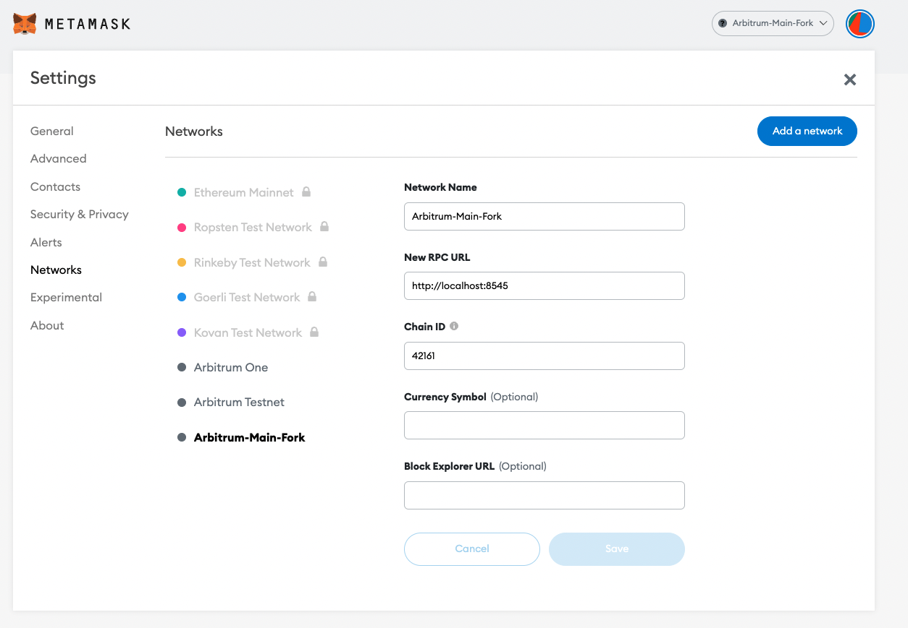

# Setting up metamask for testing 
 
## Dependencies
* [Metamask](https://metamask.io/)
* [ganache](https://www.npmjs.com/package/ganache)
* [brownie](https://pypi.org/project/eth-brownie/) 

## Setting up brownie env
* Add/update-existing configurations for arbitrum-main-fork from `./network-config.yaml` in  ~/.brownie/network-config.yaml
* run **$ brownie network list** to see the list of networks.

## Add arbitrum-main-fork network configuration to 
1. Open network dropdown in metamask
2. Click on "Add Network"
3. Enter the below details in the form
4. Save


src: [link](https://dapp-world.com/blogs/01/how-to-connect-ganache-with-metamask-and-deploy-smart-contracts-on-remix-without-1619847868947)

## Run the setup.py script
* Script initializes the metamask wallet with the balances of the tokens required for the test.
* Add any other steps required to setup the test environment.
``` bash
$ brownie run /path/to/setup.py --network arbitrum-main-fork -I
```